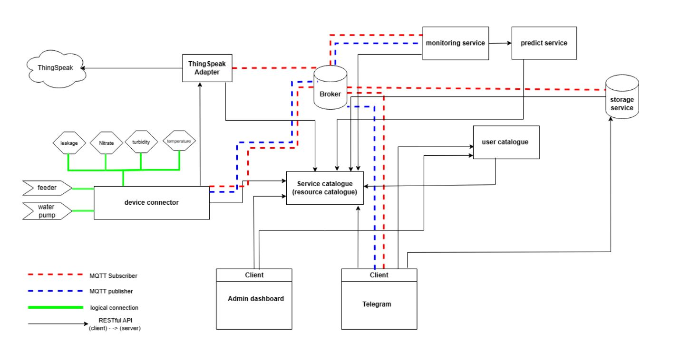

# IoT Platform for Smart Aquariums (Monitoring and Control)


This repository contains an IoT project for monitoring and controlling smart aquariums using a microservices-based architecture.
The system collects water quality data from sensors, processes and stores it, sends alerts, and allows remote control of aquarium actuators.

The project combines **MQTT (publish/subscribe)** and **REST APIs (request/response)** to demonstrate a realistic IoT platform design.

---
## System Architecture




## Project Goals

- Monitor aquarium water quality in real time
- Detect abnormal conditions using thresholds
- Predict water quality using machine learning
- Remotely control feeder and water pump
- Provide cloud visualization and user notifications
- Demonstrate a modular IoT microservices architecture
- Modular and scalable system design (allowing multiple users to manage their aquariums )
 
---

## System Architecture

The system is composed of multiple independent services communicating through an MQTT broker and REST APIs.

### Main Components

- **Device Connector**
  - Reads physical sensors (temperature, nitrate, turbidity, leakage)
  - Aggregates sensor data
  - Publishes data via MQTT
  - Subscribes to control commands
  - Controls feeder and water pump

- **MQTT Broker**
  - Central message broker
  - Enables asynchronous communication between services

- **Service Catalogue (Resource Catalogue)**
  - Service discovery
  - Device and resource registration
  - Used by all services to locate each other

- **Monitoring Service**
  - Subscribes to sensor data
  - Checks thresholds
  - Generates alerts
  - Automatic actuation of the water pump based on predicted Turbidity and Nitrate levels

- **Prediction Service**
  - Uses KNN algorithm
  - Predicts water quality based on sensor data
  - Returns the prediction to the Monitoring Service

- **Storage Service**
  - Stores sensor data in a database (MariaDB)
  - Exposes REST APIs for data retrieval

- **ThingSpeak Adapter**
  - Subscribes to sensor data
  - Sends data to ThingSpeak cloud for visualization

- **User Catalogue**
  - Manages users
  - Maps users to aquarium devices
  - Used by Telegram and Admin Dashboard

- **Admin Dashboard**
  - Web interface
  - Manages users and devices
  - Assigns devices to users

- **Telegram Client / Bot**
  - Sends alerts to users
  - Allows sending commands to devices
  - Provides basic reporting

---

## MQTT Topics

MQTT is the core communication mechanism for real-time data exchange.

### 1. Sensor Data Topics

**Publisher:** Device Connector  
**Subscribers:** Monitoring Service, Storage Service, ThingSpeak Adapter

```
aquarium/{device_id}/sensors/agg
```

Example payload:
```json
{
  "device_id": "123",
  "temperature": 26.3,
  "nitrate": 14,
  "turbidity": 8,
  "leakage": 0,
 }
```

---

### 2. Control Command Topics

**Publishers:** Telegram Client, Monitoring Service  
**Subscriber:** Device Connector

Feeder control:
```
aquarium/{device_id}/cmd/feeder
```

Water pump control (Automatically published by the Monitoring Service):
```
aquarium/{device_id}/cmd/water_pump
```


---

### 3. Alert Topics

**Publisher:** Monitoring Service  
**Subscriber:** Telegram Client

```
aquarium/{device_id}/alerts
```

Payload example:
```json
{
  "device_id": "123",
  "level": "warning",
  "value": 32,
  "message": "temperature out of range - value : 32",
  "ts": 1700000000
}

```

---

### Prediction Service (REST-based)

The Prediction Service  

It is invoked via a synchronous REST call by the Monitoring Service
to evaluate water quality based on sensor values.

**Endpoint:**
```
POST /predict
```

**Request payload:**
```json
{
  "nitrate": <number>,
  "turbidity": <number>
}
```

**Response example:**
```json
{
  "status": "ok",
  "water_quality": "good | bad",
  "ts": <unix_epoch_seconds>
}
```

The service uses a KNN classifier and is intentionally kept REST-only
to separate prediction logic from real-time MQTT data flow.

---

 

## Hardware Components

- Raspberry Pi
- Temperature sensor
- Nitrate sensor
- Turbidity sensor
- Leakage sensor
- Feeder actuator
- Water pump actuator

---

## Technologies Used

- Python
- MQTT (Mosquitto)
- REST (CherryPy)
- MariaDB
- ThingSpeak
- Telegram Bot API 
- Machine Learning (KNN)
- PHP - jQuery (admin pannel)

---

## Project Scope

This project is developed for academic purposes.
The focus is on system design, service interaction, and IoT concepts rather than production-level optimization.

---

